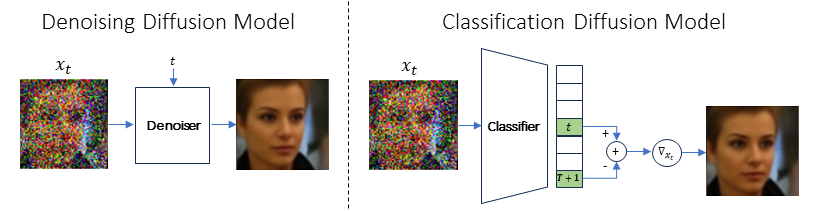
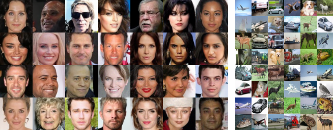

# Classification Diffusion Models: Revitalizing Density Ratio Estimation

### [NeurIPS 2024] Official pytorch implementation of the paper: "Classification Diffusion Models: Revitalizing Density Ratio Estimaion"

[Project Webpage](https://shaharyadin.github.io/CDM/)  |  [ArXiv](https://arxiv.org/abs/2402.10095)

<a href="https://www.linkedin.com/in/shahar-yadin-069725195/">Shahar Yadin</a>, <a href="https://noamelata.github.io/">Noam Elata</a>, <a href="https://tomer.net.technion.ac.il/">Tomer Michaeli</a>, Technion - Israel Institute of Technology.<br />


## Overview



A DDM functions as an MMSE denoiser conditioned on the noise level, whereas a CDM operates as a classifier. Given a noisy image, a CDM outputs a probability vector predicting the noise level, such that the $t$-th element in this vector is the probability that the noise level of the input image corresponds to timestep $t$ in the diffusion process. A CDM can be used to output the MMSE denoised image by computing the gradient of its output probability vector w.r.t the input image, as we show in our main theorem in the paper.

### Random Samples from CDM

Samples from CDMs trained on CelebA 64x64 and on CIFAR-10




## Installation

To install the necessary dependencies, install the requirements file or run the following command:

```bash
pip install torch torchvision accelerate wandb matplotlib
```

## Usage Examples

### Training

To train a CDM, change the **mode** in config/config.yaml file to "training".
For CIFAR-10, no additional setup is required.

If you wish to train the model on the CelebA dataset.

1. Download the CelebA dataset from [here](https://www.kaggle.com/datasets/jessicali9530/celeba-dataset).
2. Add the dataset path to the **dataset_path** field in config/config.yaml.

### Sampling

To generate random samples, please first train CDM (as described above), then:

1. Change the **mode** in config/config.yaml to "sampling".
2. Add the checkpoint folder and file to the **ckpt_folder** and **ckpt_file** fields in config/config.yaml.

The sampling method and the number of sampling steps can be controlled via the **sampler** and **num_sampling_steps** fields in config/config.yaml.

### Likelihood Evaluation

To generate random samples, please first train CDM (as described above), then:

1. Change the **mode** in config/config.yaml to "likelihood_eval".
2. Add the checkpoint folder and file to the **ckpt_folder** and **ckpt_file** fields in config/config.yaml.

### Running the Code

All operations (training, sampling, and likelihood evaluation) can be run using one of the following commands:

1. ```python main.py```
2. ```accelerate launch main.py```

## Citation

If you use this code for your research, please cite our paper:

```
@article{yadin2024classification,
		title={Classification Diffusion Models},
		author={Yadin, Shahar and Elata, Noam and Michaeli, Tomer},
		journal={arXiv preprint arXiv:2402.10095},
		year={2024}
	  }
```

## Sources

The code in models/diffusion.py was adapted from the following [Denoising Diffusion Implicit Models](https://github.com/ermongroup/ddim).
